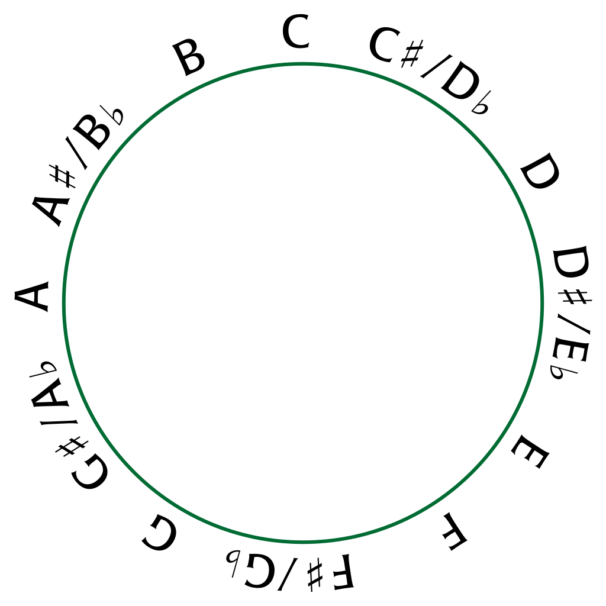

# Week -1 Theory

## Chromatic scale notes

- A, A#, B, C, C#, D, D#, E, F, F#, G, G#, A

## Tones

- `Whole tone` : e.g. A -> B i.e. a jump of two frets.
- `Semi tone`: e.g. A -> A# i.e. a jumping to next fret.

## Circle of notes

- 

# Making the major scale

## Formula

- `Root + 2 tone + 1 semitone + 3 tone + 1 semitone` 

## All major scales

### C major scale

- `C D E F G A B C`
- `Natural scale`

### Db/C# major scale

- `C# D# F F# G# A# C C#`
- Converted: `Db Eb F Gb Ab Bb C Db`
- `5b scale`

### D major scale

- `D E F# G A B C# D`
- `2# scale`

### Eb/D# major scale

- `D# F G G# A# C D D#`
- Converted `Eb F G Ab Bb C D Eb`
- `3b scale`

### E major scale

- `E F# G# A B C# D# E`
- `4# scale`

### F major scale

- `F G A A# C D E F`
- Converted: `F G A Bb D E F`
- `1b scale`

### Gb/F# major scale

- `F# G# A# B C# D# F F#`
- Converted: `Gb Ab Bb Cb Db Eb F Gb`
- `6b scale`

### G major scale

- `G A B C D E F# G`
- `1# scale`

### Ab/G# major scale

- `G# A# C C# D# F G G#`
- Converted: `Ab Bb C Db Eb F G Ab`
- `4b scale`

### A major scale

- `A B C# D E F# G# A`
- `3# scale`

### Bb/A# major scale

- `A# C D D# F G A A#`
- Converted: `Bb C D Eb F G A Bb`
- `2b scale`

### B major scale

- `B C# D# E F# G# A# B`
- `5# scale`

## Rules for major and minor scale

- No alphabets should be repeated.
- Sharps and flats will not be there in the same scale.
- All alphabtes must be present.
- If the scale does not satisfy the above then:
	- The scale is in sharp(`#`) mode.
	- To convert the scale convert it into flat(`b`) mode.

### Example F# major scale

- `F# G# A# B C# D# F F#`
- Convert `#` to `b`:
	- `Gb Ab Bb Cb Db Eb F Gb`
- `F#` major scale does not exist. We call `Gb` major scale.
- `Gb` major scale is an example of `6b scale` since it has 6 flat notes.

### Natural scale

- If a scale does not have any sharp or flat notes then it is called a natural scale.

# Making the minor scale

## Formula

- To make a minor scale, put `b` on 3rd, 6th and 7th notes of a major scale.

## Rules

- In case of the converted major scales, put the `b` on sharp(`#`) mode first.
- If the scale is still not satisfying the rules, then put the `b` on the converted scale.

## Example Cm scale

- C major scale
	- `C D E F G A B C`
- C minor scale
	- `C D Eb F G Ab Bb C`
- Since it has 3 flat notes we call it a `3b scale`.

## Example F#m scale

- F# major scale
	- `F# G# A# B C# D# F F#`
- F# minor scale
	- `F# G# A B C# D E F#`
- Since it has 3 sharp notes we call it a `3# scale`
- F# major scale does not exists but minor does since it satisfies the rules.

## All minor scales

### C minor scale

- `C D Eb F G Ab Bb C`
- `3b scale`

### C# minor scale

- `C# D# E F# G# A B C#`
- `4# scale`

### D minor scale

- `D E F G A Bb C D`
- `1b scale`

### Eb/D# minor scale

- `D# F Gb G# A# B Db D#`
- Converted: `Eb F Gb Ab Bb Cb Db Eb`
- `6b scale`

### E minor scale

- `E F# G A B C D E`
- `1# scale`

### F minor scale

- `F G Ab A# C Db Eb F`
- Converted: `F G Ab Bb C Db Eb F`
- `4b scale`

### F# minor scale

- `F# G# A B C# D E F#`
- `3# scale`

### G minor scale

- `G A Bb C D Eb F G`
- `2b scale`

### G# minor scale

- `G# A# B C# D# E F# G#`
- `5# scale`

### A minor scale

- `A B C D E F G A`
- `Natural scale`

### Bb/A# minor scale

- `A# C Db D# F Gb Ab A#`
- Converted: `Bb C Db Eb F Gb Ab Bb`
- `5b scale`

### B minor scale

- `B C# D E F# G A B`
- `2# scale`

## Relative major and minor scale

|Major|Relative Minor|Result|
|:---:|:------------:|:----:|
|C|A|Natural scale|
|Db/C#|Bb/A#|5b scale|
|D|B|2# scale|
|Eb/D#|C|3b scale|
|E|C#|4# scale|
|F|D|1b scale|
|Gb/F#|Eb/D#|6b scale|
|G|E|1# scale|
|Ab/G#|F|4b scale|
|A|F#|3# scale|
|Bb/A#|G|2b scale|
|B|G#|5# scale|

## Scale shapes

- Format `string-fret/finger`

### Shape-1

```
5-3/3 4-0/0 4-2/2 4-3/3 3-0/0
3-2/2 2-0/0 2-1/1 2-3/3 1-0/0
1-1/1 1-3/3 1-5/1 1-7/3 1-8/4
```

### Shape-2

```
6-8/4 5-5/1 5-7/3 5-8/4 4-5/1
4-7/3 3-4/1 3-5/1 3-7/3 2-5/1
2-6/2 2-8/4 1-5/1 1-7/3 1-8/4
```

### Shape-3

```
6-8/2 6-10/4 5-7/1 5-8/2 5-10/4
4-7/1 4-9/3 4-10/4 3-7/1 3-9/3
3-10/4 2-8/2 2-10/4 1-7/1 1-8/2
```

### Shape-4

```
6-8/1 6-10/3 6-12/4 5-8/1 5-10/3
5-12/4 4-9/1 4-10/2 4-12/4 3-9/1
3-10/2 3-12/4 2-10/1 2-12/3 2-13/4
```

#### Combination

- Practice shape-1 in downward motion then shape-2 in upward motion and then
  shape-3/4 in downward motion.
- Practice the above pattern in reverse also.
- Practice with metronome

# Exercise-1 in D-minor

- Format `string-fret/finger`

```
4-7/3 3-7/3 3-6/2 3-7/3 2-6/2 3-7/3 3-6/2 3-7/3
1-5/1 3-7/3 3-6/2 3-7/3 1-6/2 3-7/3 3-6/2 3-7/3
1-5/1 2-8/4 2-6/2 1-5/1 2-8/4 2-6/2 2-5/1 2-8/4
2-6/2 2-5/1 3-7/3 2-6/2 2-5/1 3-7/3 3-6/2 3-7/3

3-7/3 4-7/3 5-8/4 4-7/3 5-5/1 5-8/4 6-5/1 5-5/1
5-5/1 6-5/1 6-8/4 5-5/1 4-7/3 3-7/3 2-6/2 1-5/1
1-6/2 2-8/4 2-5/1 2-8/4 3-7/3 2-6/2 4-7/3-s-4-8/3
4-5/1 4-8/4 5-7/3 4-5/1 4-7/3 3-7/3 3-6/2 2-5/1

3-7/1 1-10/4 3-7/1 1-8/2 3-7/1 1-7/1 3-7/1 2-10/4
3-7/1 2-8/2 3-7/1 2-7/1 3-9/4 3-7/2 3-6/1 3-7/2
3-5/1 1-8/4 3-5/1 1-7/3 3-5/1 1-5/1 3-5/1 2-8/4
3-5/1 2-6/2 3-5/1 2-5/1 3-7/4 3-5/2 3-4/1 3-5/2

1-5/1 2-8/4 2-6/2 2-5/1 1-6/2 1-5/1 2-8/4 2-6/2
1-8/4 1-6/2 1-5/1 2-8/4 1-10/4 1-8/3 1-6/2 1-5/1
2-6/2 1-5/1 2-5/1 1-5/1 3-7/3 1-5/1 3-6/2 1-5/1
4-7/3 1-5/1 3-6/2 1-5/1 3-7/3(sustain)
```
- `-s-` means slide.
